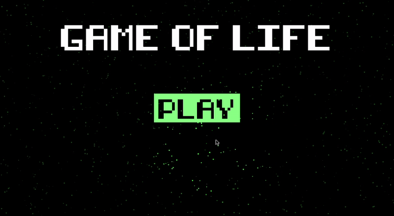

# Game of Life
My first attempt at pygame. The game 'Geometry Wars' was inspiration and I used shapes from 'Conway's Game of Life' for the sprites.

## How to play (linux):
* If you don't have pipenv: `python3 -m pip install pipenv pipenv-shebang`
* `pipenv sync`
* `./gameOfLife.py`
